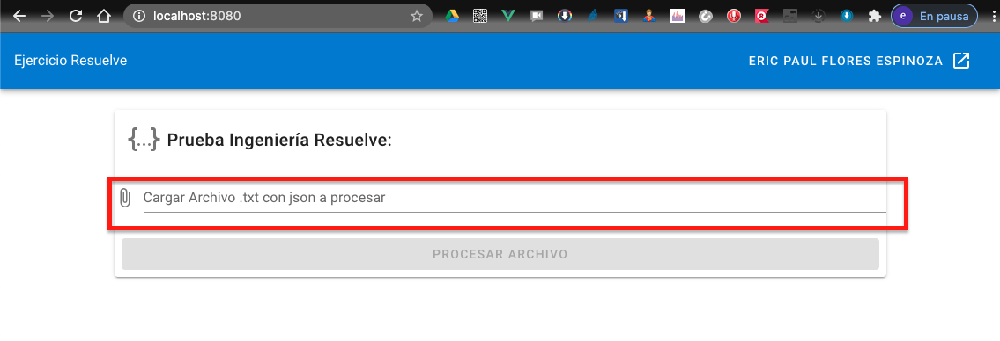
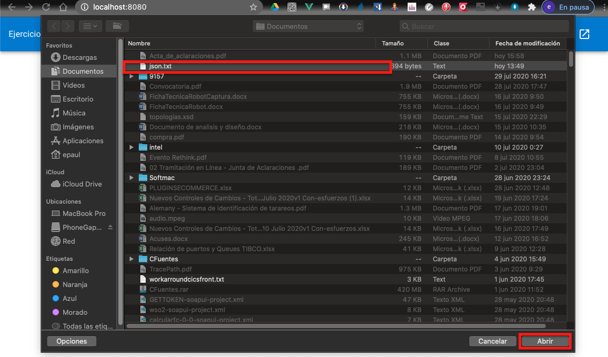
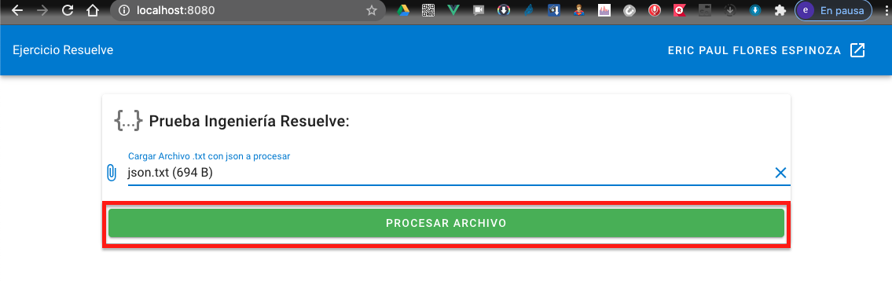
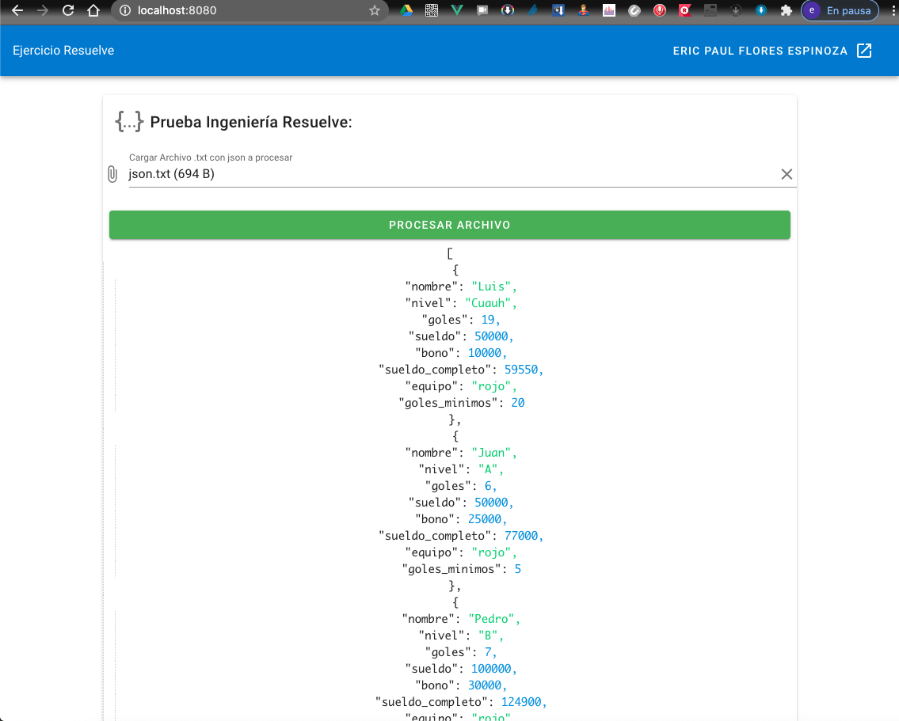

# Prueba ingeniería Resuelve

Propuesta de solución al problema [Resuelve](https://github.com/resuelve/prueba-ing-backend/blob/master/README.md)

## Manual de usuario

- Descargar archivo Json para el [test](assets/json.txt)

- Dar clic en el inpud de cargar archivo



- Seleccionar el archivo Json "json.txt"



- Una vez cargado el archivo json, dar clic en boton procesar archivo



- Revisar json obtenido



## Instalar dependencias

2. Entrar a la raiz del proyecto y escribir el comando

```
npm install
```

## Compilar para producción

3. En línea de comandos escribir

```
npm run build
```

4. Al terminar el proceso de compilado se creara el directorio "dist"

5. Copiar el contenido del directorio "dist" en la ruta de despliegues del servidor de aplicaciones

## Para Desarrollo

### Compiles and hot-reloads for development

```
npm run serve
```

### Lints and fixes files

```
npm run lint
```

### Customize configuration

See [Configuration Reference](https://cli.vuejs.org/config/).
